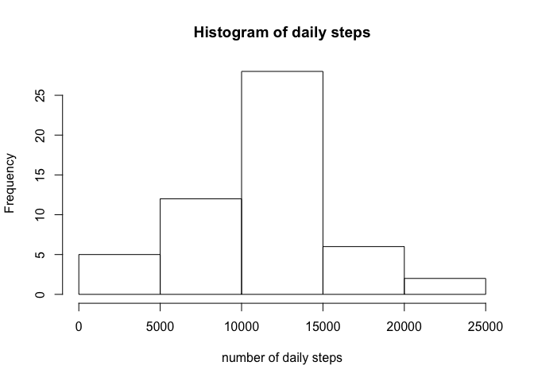
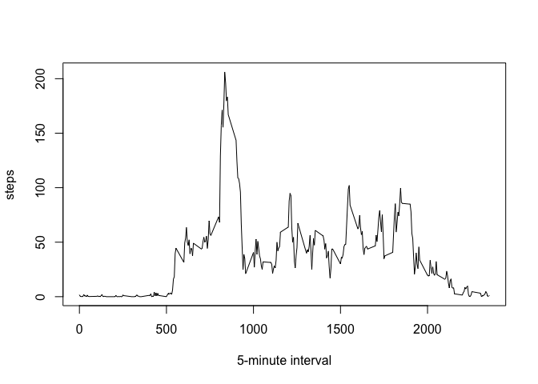
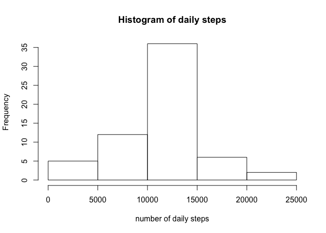
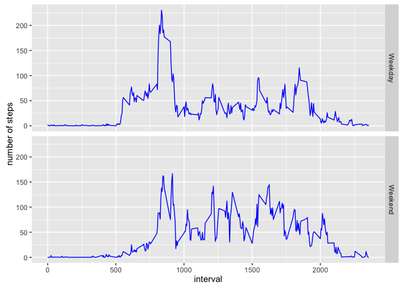

# Reproducible Research: Peer Assessment 1


## Loading and preprocessing the data

```r
activity <- read.csv("activity.csv")
```


## What is mean total number of steps taken per day?

```r
dailystep <- aggregate(steps ~ date, data = activity, sum)
meandailystep <- mean(dailystep$steps)
mediandailystep <- median(dailystep$steps)
options(scipen = 1, digits = 2)
```

The mean total number of steps taken per day is 10766.19, and the median of the total number of steps taken per day is 10765.

A histogram showing the total number of steps taken each day is shown below.

```r
hist(dailystep$steps, xlab = "number of daily steps", main = "Histogram of daily steps")
```

<!-- -->

## What is the average daily activity pattern?

```r
avginterval <- aggregate(steps ~ interval, data = activity, mean, na.rm = TRUE)
plot(avginterval$interval, avginterval$steps, type = "l", xlab = "5-minute interval", ylab = "steps")
```

<!-- -->


```r
maxavginterval <- avginterval$interval[which.max(avginterval$steps)]
```
The 5-minute interval, on average across all the days in the dataset, that contains the maximum number of steps is 835.

## Imputing missing values


```r
numNA <- nrow(activity) - sum(complete.cases(activity))
```
The total number of missing values in the dataset (i.e. the total number of rows with NAs) is 2304.

Next we will use the mean for that 5-minute interval to fill in all of the missing values in the dataset. After imputing, the histogram of the total number of steps taken each day is plotted again for comparison.

```r
newactivity <- activity
nainterval <- activity$interval[is.na(activity$steps)]
newactivity$steps[is.na(activity$steps)] <- avginterval$steps[avginterval$interval %in% nainterval]

newdailystep <- aggregate(steps ~ date, data = newactivity, sum)
newmeandailystep <- mean(newdailystep$steps)
newmediandailystep <- median(newdailystep$steps)
hist(newdailystep$steps, xlab = "number of daily steps", main = "Histogram of daily steps")
```

<!-- -->

The mean total number of steps taken per day after imputing is 10766.19, and the median of the total number of steps taken per day after imputing is 10766.19. Compared with the results before imputing, we can find that the mean value stays the same but the median values changes a bit to be the same as the mean value. This is expected since we used the 5-min interval average to do the imputation. The impact of imputing missing data on the estimates of the total daily number of steps is the enhanced probablity towards the mean value.

## Are there differences in activity patterns between weekdays and weekends?

In this section, first we create a new factor variable in the dataset with two levels – “weekday” and “weekend” indicating whether a given date is a weekday or weekend day. Then we will make a panel plot containing a time series plot of the 5-minute interval (x-axis) and the average number of steps taken, averaged across all weekday days or weekend days (y-axis).


```r
dateweekday <- weekdays(as.Date(as.character(newactivity$date)))
weekdayset <- c("Monday", "Tuesday", "Wednesday", "Thursday", "Friday")
isweekday <- factor((dateweekday %in% weekdayset), levels = c(TRUE, FALSE), labels = c("Weekday", "Weekend"))
newactivity <- cbind(newactivity, isweekday)
avginterval_wd <- aggregate(newactivity$steps, list(interval = newactivity$interval, weekday = newactivity$isweekday), mean)

library(ggplot2)
plot <- ggplot(avginterval_wd, aes(interval, x)) + labs(y = "number of steps") + geom_line(color = "blue") + facet_grid(weekday ~ .)
print(plot)
```

<!-- -->

From the panel plot we can observe the differences in activity patterns between weekdays and weekends. The plot on weekday has a large spike during interval 750-1000, while the activity on weekend doesn't have such peak. Besides, the average number of steps taken during the daytime on weekend is larger than that on weekday.

